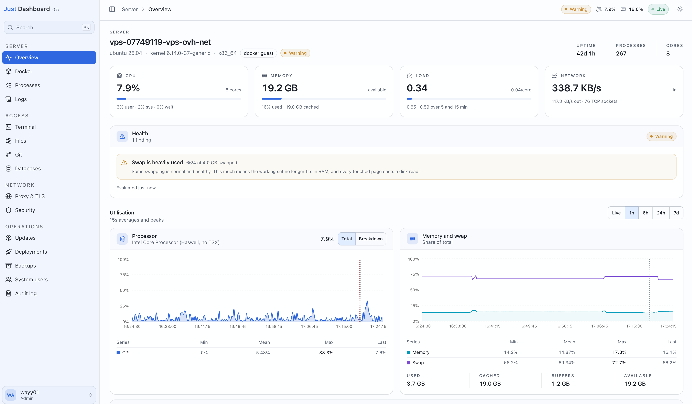
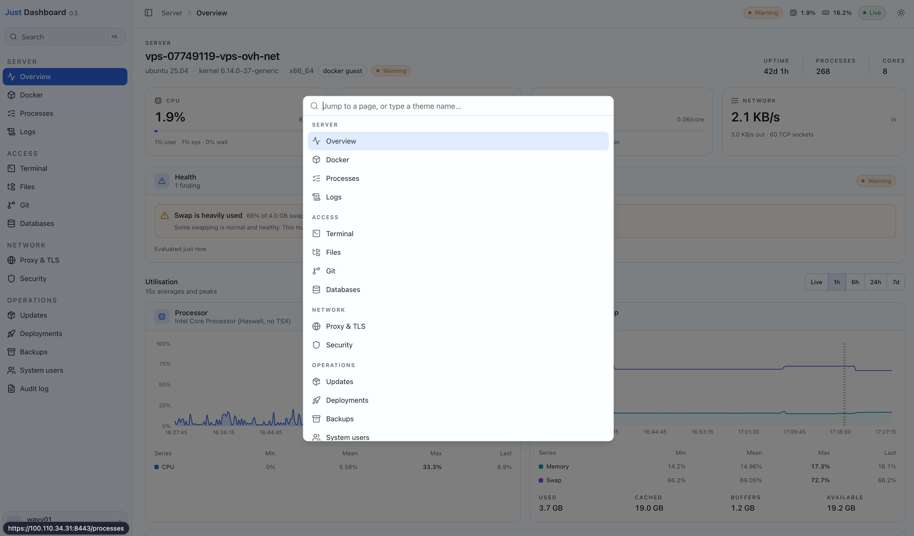
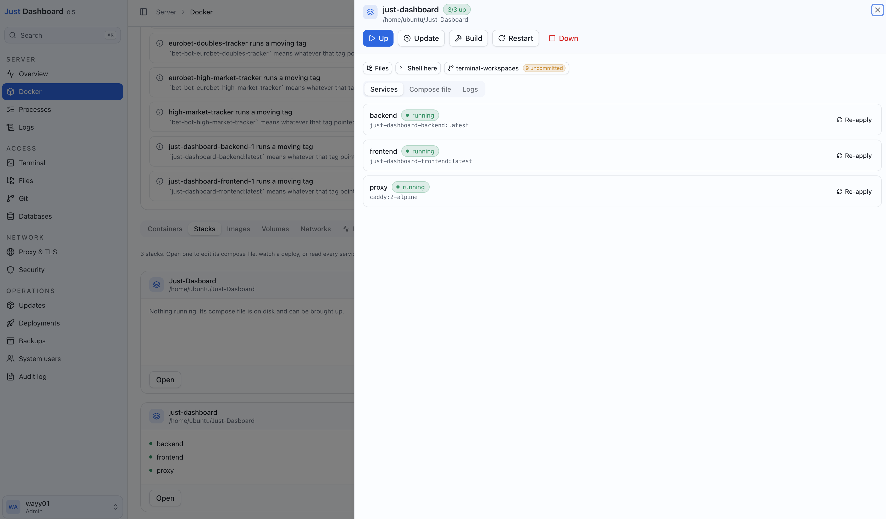
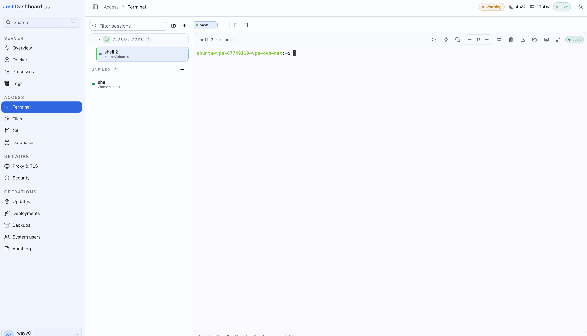
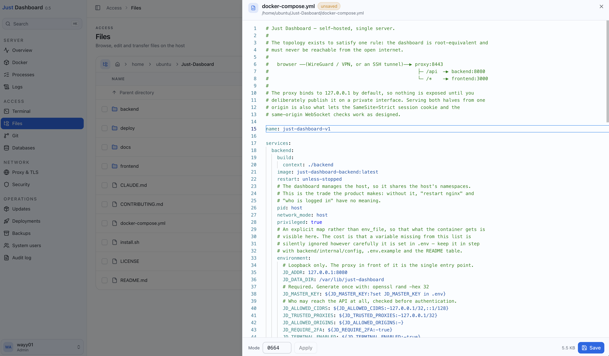
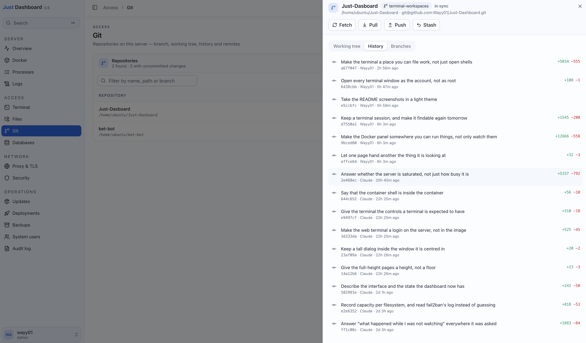

<div align="center">

# Just Dashboard

**One authenticated UI for one Linux server.**
Metrics, Docker, processes, logs, a real shell, files, git, databases, the reverse proxy,
the firewall, backups and deploys, behind a login that lives on your private network.

**Version 0.5** · Go backend · Next.js frontend · one `docker compose` stack

[Install](#install) · [Security](#read-this-before-you-expose-it) · [The tour](#the-tour) · [Version](#version) · [Configuration](#configuration-reference) · [Licence](#licence)

</div>



---

## Why

Most panels of this kind show you a number and leave the reading to you: 68% CPU, exit code
137, restarted 12 times. Fine, and then what?

Just Dashboard tries to answer the next question instead. It records its own history so the
charts cover the night nobody had the tab open. It tells you the server is *waiting* rather
than merely *busy*, because iowait, CPU steal and kernel pressure have completely different
fixes. It says a container was killed for exceeding its memory limit and what the limit was.
It renders the `docker run` line before it runs anything. It keeps a shell alive so tomorrow
you pick up where you stopped.

It manages exactly one machine. There is no fleet view, no agents to enrol, no cluster.

## Install

```bash
git clone https://github.com/Wayy01/Just-Dashboard.git
cd Just-Dashboard && sudo ./install.sh
```

Four or five questions, and only one of them really matters: how you intend to reach it.
**Tailscale is the default.** Your laptop and phone get in from anywhere while the machine
stays invisible to the internet, and the installer will set it up for you. An SSH tunnel is
the fallback: nothing to install, no account, and it still works on a day Tailscale does not.

The installer then generates the master key and a first password, writes `.env`, builds,
waits for the stack to answer and prints the exact command to get in. Re-running it later
keeps your `.env` and just rebuilds, so it is safe after a `git pull`.

Prefer to do it by hand? [Setting it up without the installer](#setting-it-up-by-hand).

## Read this before you expose it

**This dashboard is root-equivalent.** It drives systemd, the firewall, host accounts, the
Docker socket and a PTY. Anyone who reaches it with a valid session has root on the machine.

It is built to sit behind a VPN or an SSH tunnel, and that is enforced rather than suggested:

- The backend **refuses to start** on a non-loopback address without an explicit
  `JD_ALLOWED_CIDRS` allowlist.
- The allowlist is checked **before authentication**. Off-network you cannot reach the login
  handler at all, let alone guess at it.
- Two-factor is **mandatory**. A correct password on its own yields a session that every
  route rejects except the 2FA ones.
- Destructive actions pause for a confirmation, and the rare, unrecoverable ones — dropping a
  table, removing a volume, deleting an account, restoring over live data — additionally
  require a **typed confirmation phrase**, checked on the server, so it cannot be skipped by
  calling the API directly. The line is drawn by *frequency*: a phrase in front of something
  done a dozen times a day gets typed rather than read, which is exactly how it stops working
  on the routes that need it.
- Every state-changing request lands in an **audit log**: who, what, when, from where, and
  whether it worked.

The **Security** page reports how the dashboard is actually reachable and says so plainly
when that is wider than a private network. A machine that quietly became internet-facing
announces itself instead of waiting to be discovered.

---

## The tour

### Overview: utilisation, and whether the server is saturated

CPU split by user, system, iowait and **steal**. Memory judged on what is *available*, never
on "used", because Linux counts the page cache there and judging a server by it produces a
permanent, meaningless warning. Kernel pressure from PSI, the run queue and its blocked
count, per-filesystem capacity **and inodes**, disk throughput with IOPS and service time,
socket totals, per-interface rates, and a directory size scan when you ask for one.

Hovering any chart marks the same instant on every other chart on the page, and every legend
switches to the value its series held at that moment. Drag across a chart to zoom into a
span; zooming out returns to the window you were in, not to where you started.

Live data is pushed over a WebSocket. The 1h, 6h, 24h and 7d windows come from history the
backend records on its own timer, peaks kept next to means, so a 100% second inside a
ten-minute bucket does not average away into a quiet night that was not quiet.

Deploys, backups, reboots and destructive actions are marked on the charts, so a step in a
line sits next to whatever caused it. Reboots are inferred from a sample whose uptime is
lower than its predecessor's, which also catches the restart nobody started from here.

**Health** turns all of that into a verdict: disks and inodes filling, memory headroom, CPU
steal, kernel pressure, swap, socket exhaustion. Each finding carries what was measured, what
it means and what to do about it. It is evaluated on the server against the last hour of
history, so a spike is told apart from a trend, and it is visible from every page.

### Everything is one keystroke away



**⌘K** from anywhere. Every page and every theme, because a server dashboard is navigated by
someone who already knows where they are going. The top bar keeps CPU, memory and the health
verdict in view while you are elsewhere.

### Docker: a panel you can run things from



**Run a container** from a starting point, from a pasted `docker run` command, or from a
blank form. The command and the compose service it would produce are rendered back to you,
by the server, before anything runs. Templates are a set of sane starting points with ports
bound to loopback, not an app store to maintain.

**Update one in place.** Pull a newer image and rebuild the container from the settings it
already has. The old container is renamed aside and restored if anything goes wrong, and
removed only once the replacement is up.

**A verdict on what is wrong, in sentences.** Why a container exited and what the limit was,
that one has restarted twelve times in a minute, that a health check is failing and what it
last said, that a port is published in front of the firewall, that an unrotated log has
reached 800 MB, that the data being written will not survive the next update. Where the
dashboard can carry out the fix, the finding comes with a button.

**Stacks as the applications they are.** Up, Update, Build, Restart and Down, each streamed
line by line as it runs rather than hanging on a request for four minutes. The compose file
is editable in place and validated before saving, and saving is not deploying: the UI says
so. From a stack you jump straight to its directory in Files, a shell in it, or its git
repository, with the uncommitted count already on the button.

**The rest of the surface.** Live stats and a last-hour sparkline per container row. Recorded
per-container CPU, memory, network and block I/O, keyed by name so it survives a redeploy.
Images with an update check that asks the registry what the tag points at *now* and compares
it with the digest you pulled. Volumes with what mounts them and a link to browse inside.
Networks with who is attached. Streaming logs, a shell in the container, raw inspect, and the
daemon's own event stream kept in memory so an overnight OOM kill is still there in the
morning.

### Terminal: sessions that are still there tomorrow



A real PTY over a WebSocket, running `su -l` into a host account, not a shell inside the
container. Your dotfiles, your PATH, your installed tools.

Backed by tmux, so closing the tab, leaving the page and restarting the dashboard all leave
the session running. Only closing one stops it, and that asks first. The
title, the folder and the favourite flag live on the tmux session itself, which is why a
session picked up after a restart is still called what you called it.

Name a session, file it in a colour-coded folder, drag it somewhere else, filter the list,
pin the two or three you actually live in. A session created in a folder inherits its colour,
because colouring eight sessions by hand is work nobody does twice.

tmux windows along the top, with splits, zoom, `synchronize-panes` and the bell and activity
flags tmux has always tracked and nothing else surfaces, which is the only answer to "which
of these five tabs did something while I was looking at another one". Clicking inside a pane
focuses it.

Moving between sessions, windows and panes has a key for each, and every binding is yours to
change: the shortcut sheet is the editor, not a read-only list. Per pane there is scrollback
search, copy, font size, clear, fullscreen and a row of the keys a browser normally eats
(`Ctrl+C`, `Ctrl+D`, `Ctrl+Z`, `Ctrl+L`, `Esc`, `Ctrl+\`). Middle-click pastes, the way it
does in X11.

The page has no title band, because a terminal is the one screen whose content is the
viewport. Opening and closing a session is recorded in the audit log.

### Files: browse, edit, and mean the host's paths



Monaco for editing, with the mode editable next to the save button. Upload, download, chmod,
chown, search by name or by content, archive and extract.

Every client-supplied path goes through one resolver that checks the cleaned path *and* the
symlink-resolved path against `JD_FILE_ROOTS`, including the paths that do not look like file
operations: a bind mount source, a build context, a restore destination. Archive extraction
refuses absolute symlink targets and never writes through a symlink already sitting in the
destination.

### Git: the repositories that are actually on the server



Every repository under the configured roots, found by walking them rather than by being
registered. Branch, ahead/behind, working tree, history with diffs and per-commit line
counts, branches, and fetch, pull, push and stash.

Each command runs as the account that owns the repository, so a pull on a repo owned by
`deploy` does not leave root-owned files behind for you to find later.

### And the rest

| | |
| --- | --- |
| **Processes** | PM2 apps with merged output tailing, systemd units with journal streaming, and an htop-style table sortable by CPU **or** memory, because a leaking service sits at 0% CPU holding gigabytes. Kill is guarded. Crontab editor included. |
| **Logs** | One viewer over files, container output, PM2 and the journal. Grep and level filters are applied on the server, before the lines are sent. |
| **Proxy & TLS** | nginx and Caddy config editing, validated with the server's own test binary before writing or reloading. Vhost toggles, certificate inventory with expiry, listening ports joined to the processes that own them. |
| **Databases** | Eight engines: PostgreSQL, MySQL/MariaDB, SQLite, SQL Server, ClickHouse, Oracle, MongoDB and Redis — all on pure-Go drivers, so the image still needs no CGO. A data grid that edits rows through forms (always scoped to a primary key), server-side sort and filtering, schema editing with the statement shown before it runs, CSV/JSON import inside one transaction, a structure view and an entity diagram, a query runner that classifies a statement as destructive before it runs with schema-aware completion, history and saved snippets, CSV/JSON export, one-click Prisma, Drizzle, TypeScript or Zod generation from the live database, and a value search that finds which table an id lives in without knowing where to look. A Monitor tab lists what the server is running right now — with the blocking session named — and stops a stuck query, next to a per-table size breakdown for when the disk alert fires. Any row copies out as JSON or as a runnable INSERT in that engine's own syntax, or duplicates into a pre-filled form. MongoDB gets document editing, an aggregation runner, and its own export and import; Redis gets a SCAN-based key browser with full collection editing. Plus dumps and restores. Passwords never appear in argv. Everything but Oracle is covered by tests that run against the real engines. |
| **Security** | How the dashboard is exposed and what to do about it, firewall rules, fail2ban jails and what they have actually banned, active SSH sessions, and the host's own login record: who got in, who tried and failed, and when the machine restarted. |
| **Updates** | What is behind, which of it is security, and whether a reboot is due. Upgrades only. It never installs or removes packages. |
| **Deployments** | Git pull plus `compose up -d --build`, by hand or by signed webhook, with history and rollback. Encrypted per-project environment rendered into `.env` at deploy time. |
| **Backups** | Scheduled archives to local disk, S3 or Backblaze B2, with retention and restore. |
| **System users** | Host accounts, SSH keys, lock and unlock. |
| **Audit log** | Every state-changing request, filterable by actor, action and outcome. |
| **Appearance** | Twelve palettes, nine dark and three light, applied before the page paints so a light theme never flashes black. The choice belongs to the browser you are sitting at, not to the account. |

---

## Version

This is **0.5**: the panel as a finished single-server product — every page in the tour above
is built and in use. It is not 1.0 because the API is still moving. 1.0 is when it stops.

The number is on screen, beside the wordmark in the sidebar and on the sign-in page, because
this is software you upgrade by pulling and rebuilding, and "which one is this machine
running" is a question with consequences. The server says so at boot as well:

```bash
docker compose logs backend | grep listening
```

Moving to 0.6 when the next batch of features lands, or to 1.0 when the API settles, is two
lines and nothing else:

| File | Line |
| --- | --- |
| `backend/internal/version/version.go` | `const Version = "0.5"` |
| `frontend/src/lib/version.ts` | `export const VERSION = "0.5"` |

Every place that displays or logs a version reads one of those two constants, and
`go test ./internal/version/` fails if they disagree — so a release cannot half-happen and
leave a UI claiming a version the server has never heard of.

---

## Roles

Capabilities are checked on the route, never in the UI alone. The frontend hides what a role
cannot use; the server re-decides every request anyway.

Roles divide what you can *change*, not what you can *see*. "View everything" is meant
literally: a `readonly` account reads any file inside `JD_FILE_ROOTS`, any compose file, any
proxy config and any deploy log, and those routinely hold credentials. Container environments
are redacted below `system.admin`, which raises the cost of reading a secret rather than
preventing it. Give `readonly` to someone you would let read the disk, and narrow
`JD_FILE_ROOTS` if that is not what you meant.

| | `readonly` | `limited` | `admin` |
| --- | :---: | :---: | :---: |
| View everything | ✅ | ✅ | ✅ |
| Start / stop / restart services | | ✅ | ✅ |
| Git fetch / pull / push / checkout | | ✅ | ✅ |
| Edit files | | ✅ | ✅ |
| Terminal and container shells | | | ✅ |
| Delete, prune, kill, restore, git reset | | | ✅ |
| Apply system updates | | | ✅ |
| Host accounts, firewall, users, tokens | | | ✅ |

New accounts must change their password and enrol 2FA before anything else works.

---

## Configuration reference

<details>
<summary>Every environment variable the backend reads</summary>

<br>

The installer writes the ones that matter. These are for tuning afterwards.

**Required**

| Variable | Description |
| --- | --- |
| `JD_MASTER_KEY` | 64 hex characters. Encrypts every stored secret. `openssl rand -hex 32`. |

**Network perimeter**

| Variable | Default | Description |
| --- | --- | --- |
| `JD_SITE` | `localhost` | The address the stack answers on and the name on its certificate. Your Tailscale address is the recommended value. Loopback is bound alongside it either way, so an SSH tunnel always works. Never `0.0.0.0`. |
| `JD_ALLOWED_CIDRS` | `127.0.0.1/32,::1/128` | Who may reach the API at all, checked before authentication. Use `100.64.0.0/10,127.0.0.1/32,::1/128` for Tailscale, and keep loopback or you lose the tunnel. |
| `JD_TRUSTED_PROXIES` | none | Addresses allowed to set `X-Forwarded-For`. Without it a client could spoof its way past the allowlist. One hop is supported: the bundled Caddy replaces the header with the client's real address, so anything placed *in front* of Caddy becomes the client as far as the allowlist is concerned. |
| `JD_ADDR` | `127.0.0.1:8080` | Where the API binds. Leave it on loopback; the proxy is the entry point. |
| `JD_ALLOWED_ORIGINS` | none | Extra browser origins allowed to open WebSockets. Only needed if the UI is served from a different origin. |

**Behaviour**

| Variable | Default | Description |
| --- | --- | --- |
| `JD_REQUIRE_2FA` | `true` | Mandatory two-factor. Turning it off is refused for accounts that already enrolled. |
| `JD_TERMINAL_ENABLED` | `true` | The web terminal. |
| `JD_TERMINAL_SHELL` | account's shell | Overrides the login shell. Empty honours `chsh`. |
| `JD_TERMINAL_USER` | lowest regular account | Host account a terminal session logs in as. |
| `JD_SESSION_TTL` | `12h` | Absolute session lifetime. |
| `JD_SESSION_IDLE_TTL` | `60m` | Idle timeout. |
| `JD_DOCKER_HOST` | `unix:///var/run/docker.sock` | Docker Engine endpoint. |
| `JD_METRICS_INTERVAL` | `15s` | How often the backend samples the host, and every running container, into its own history. Clamped to 5s and 5m. |
| `JD_METRICS_RETENTION` | `7d` | How long that history is kept. Accepts days. `0` records nothing and leaves only the live feed. |
| `JD_AGENT_MODE` | `false` | Run as an agent managed by a hub: no login, mutual TLS only. Not useful on its own yet. |
| `JD_DEV` | `false` | Development only. Drops `Secure` from the session cookie so the UI works over plain HTTP. Never set it on a real host. |
| `JD_LOG_LEVEL` | `info` | `debug` for verbose logs. |

**Where it looks**

| Variable | Default | Description |
| --- | --- | --- |
| `JD_FILE_ROOTS` | `/` | Directories the file manager may reach. |
| `JD_LOG_ROOTS` | `/var/log` | Directories the log viewer may read. |
| `JD_COMPOSE_ROOTS` | `/opt,/srv,/home` | Where compose stacks are discovered. |
| `JD_GIT_ROOTS` | `/opt,/srv,/home,/root` | Where the Git page looks for repositories. |
| `JD_DEPLOY_ROOTS` | `/opt,/srv,/home,/root` | Where a deploy project's repository may live. A project outside these is refused. |
| `JD_NGINX_DIR` | `/etc/nginx` | nginx configuration root. |
| `JD_CADDYFILE` | `/etc/caddy/Caddyfile` | Caddy configuration file. |
| `JD_BACKUP_DIR` | `/var/backups/just-dashboard` | Local backup destination and staging. |
| `JD_DATA_DIR` | `/var/lib/just-dashboard` | The dashboard's own database. **Back this up.** |

**First run only**

| Variable | Default | Description |
| --- | --- | --- |
| `JD_BOOTSTRAP_USER` | `admin` | Account created on an empty database. |
| `JD_BOOTSTRAP_PASSWORD` | none | Leave empty for a generated one, logged once. |

Durations take a unit (`12h`, `60m`, and the metrics settings also accept `7d`); booleans
take `true` or `false`. A value that cannot be parsed stops the dashboard at startup rather
than falling back to the default, so a typo is visible instead of silently in effect.

</details>

<details>
<summary>Upgrading from VPS Dashboard</summary>

<br>

This project used to be called VPS Dashboard. Its settings were prefixed `VPSD_`, it kept
state in `/var/lib/vps-dashboard`, and its compose project was named `vps-dashboard`.
**`sudo ./install.sh` migrates all three for you**: it rewrites `.env` (keeping a backup),
moves the two directories, stops the old stack and rebuilds. That is the recommended path
after a `git pull`.

By hand:

```bash
sudo sed -i -e 's/^VPSD_/JD_/' \
  -e 's|/var/lib/vps-dashboard|/var/lib/just-dashboard|g' \
  -e 's|/var/backups/vps-dashboard|/var/backups/just-dashboard|g' .env
sudo docker compose -p vps-dashboard down
sudo mv /var/lib/vps-dashboard /var/lib/just-dashboard
sudo mv /var/backups/vps-dashboard /var/backups/just-dashboard
sudo docker compose up -d --build
```

`/var/lib/vps-dashboard` is your database: accounts, TOTP enrolments, the audit log. Move it
rather than letting a fresh one be created beside it. Running the binary directly instead of
under compose? Skip all of this. The backend reads a `VPSD_` name when the `JD_` one is
unset, and adopts the old data directory when the new one has no database in it.

</details>

---

## Scripting it

<details>
<summary>API tokens and deploy webhooks</summary>

<br>

**API tokens.** Create one under **Account → API tokens**:

```bash
curl -H "Authorization: Bearer vpsd_…" https://localhost:8443/api/v1/system/metrics
```

A token can narrow its creator's role but never widen it, and is demoted automatically if
that account is. Tokens cannot change a password, mint other tokens or manage accounts. Those
need a real session.

**Deploy webhooks.** Create a project under **Deployments** for a hook URL and a secret shown
once:

```bash
BODY='{"ref":"refs/heads/main"}'
SIG="sha256=$(printf '%s' "$BODY" | openssl dgst -sha256 -hmac "$SECRET" | awk '{print $2}')"

curl -X POST "https://your-dashboard:8443/api/v1/hooks/deploy/$HOOK_ID" \
  -H "Content-Type: application/json" \
  -H "X-Hub-Signature-256: $SIG" \
  -d "$BODY"
```

That is the format GitHub sends by default, so a GitHub webhook needs no glue. It is the only
endpoint without a dashboard session, it authenticates by HMAC over the raw body, and it
still sits behind the network allowlist.

On delivery the project is fetched, hard-reset to its branch, its encrypted environment is
rendered into `.env`, and the stack is rebuilt.

</details>

## How it fits together

<details>
<summary>Architecture and the privilege model</summary>

<br>

```
browser ──(Tailscale / SSH tunnel)──▶ Caddy :8443
                                        ├─ /api/* ─▶ backend :8080  (loopback)
                                        └─ /*     ─▶ frontend :3000 (loopback)
```

Only Caddy binds a routable address; the backend and frontend are unreachable from outside
the machine. Serving both from **one origin** is not cosmetic: the session cookie is
`HttpOnly; SameSite=Strict` and the API rejects cross-origin WebSocket upgrades, so a split
origin would break both by design.

Every request passes the same chain:

```
network allowlist → rate limit → authenticate → capability → handler
```

Destructive routes get a tighter rate budget, and the rare irreversible ones also require a
typed confirmation phrase.

**On privileges.** The compose file grants the backend `privileged: true`, `pid: host` and
the Docker socket. That is what makes "restart this unit" and "kill this process" mean
anything, and it also means the security boundary is the network perimeter plus 2FA, not the
container. Read `docker-compose.yml` before deploying and narrow the mounts if your use case
allows.

**Reaching the host, not the container.** The dashboard manages a server, so everything it
reports has to be about the server rather than the container it runs in. Two mechanisms keep
that true.

*The directories it manages are mounted at their real paths.* `/home`, `/opt`, `/srv`,
`/root`, `/etc` and `/var/log` appear inside the container under the same names, because the
dashboard addresses files by the path you would type over SSH. Remove a mount and the file
manager, git discovery and compose scanning quietly browse the container's own empty
filesystem instead. Narrow them if you like, but narrow `JD_FILE_ROOTS`, `JD_GIT_ROOTS` and
`JD_COMPOSE_ROOTS` to match.

*Host tools run on the host.* nginx's config is readable here but its binary is not, and
shipping a second copy would validate your config against different modules than the server
actually uses. Anything in that category (`nginx`, `caddy`, `ufw`, `fail2ban-client`, `who`)
runs in the host's namespaces via `nsenter`, with an argv and never a shell string. It is
also why the dashboard can tell you fail2ban is *not installed* rather than reporting on a
copy that shipped in its own image.

Where a tool writes files it runs as the account owning that directory.

</details>

## Developing on it

<details>
<summary>Running the two halves locally</summary>

<br>

```bash
# Backend on :8080
cd backend && go run ./cmd/server

# Frontend on :3000
cd frontend && bun install && bun dev
```

The frontend proxies `/api` to the backend in development, so there is no CORS setup.
WebSockets are the exception: Next does not proxy upgrades, so set
`NEXT_PUBLIC_WS_BASE=http://localhost:8080` to point them at the backend directly.

Before opening a pull request:

```bash
cd backend  && go build ./... && go vet ./... && go test ./...
cd frontend && bun run lint && bun run build
```

bun is the package manager. Do not add `package-lock.json` or `yarn.lock`.

</details>

## Setting it up by hand

<details>
<summary>Without the installer</summary>

<br>

```bash
cp .env.example .env
```

Edit it. Two settings matter more than the rest:

```bash
# Encrypts TOTP seeds, database strings, deploy env and backup credentials.
# Generate once. Losing it loses every stored secret.
JD_MASTER_KEY=$(openssl rand -hex 32)

# The address the dashboard answers on. Your Tailscale address is recommended;
# localhost means reachable only through an SSH tunnel. Either way loopback is
# bound too, so a tunnel is always available as a fallback.
JD_SITE=localhost
```

Then:

```bash
docker compose up -d --build
docker compose logs backend | grep "bootstrap admin"
```

That last line prints the generated admin password **once**.

</details>

---

## Backing it up

The dashboard's own state is a SQLite database in `JD_DATA_DIR`
(`/var/lib/just-dashboard`). It holds accounts, TOTP enrolments, API tokens, the audit log
and every encrypted secret.

Back up that directory **and** keep `JD_MASTER_KEY` somewhere separate. Either one alone will
not restore.

## Licence

[AGPL-3.0](LICENSE). Run it, change it, distribute it, but if you run a modified version as a
network service, publish your changes. Contributions are welcome under the terms in
[CONTRIBUTING.md](CONTRIBUTING.md).
