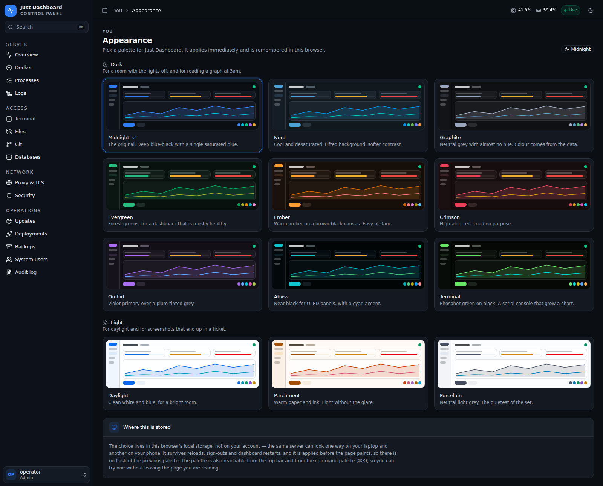

# Just Dashboard

One authenticated UI for a single Linux server — metrics, Docker, processes,
logs, a real shell, files, git, databases, the reverse proxy, the firewall,
backups and deploys. Go backend, Next.js frontend, one `docker compose` stack.


---

## Install

```bash
git clone https://github.com/Wayy01/Just-Dashboard.git
cd Just-Dashboard && sudo ./install.sh
```

It asks four or five questions, and the one that matters is how you intend to
reach it. **Tailscale is the default** — your laptop and phone get in from
anywhere while the machine stays invisible to the internet — and the installer
will set it up for you. An SSH tunnel is the fallback: no extra software, no
account, still works if Tailscale is ever down.

Then it generates the master key and a first password, writes `.env`, builds,
waits for the stack to answer, and prints the exact command to get in.

Re-running it later keeps your `.env` and just rebuilds, so it is safe after a
`git pull`.

---

## Before you expose it

**This dashboard is root-equivalent.** It drives systemd, the firewall, host
accounts, the Docker socket and a PTY. Anyone who reaches it with a valid
session has root on the machine.

It is built to sit behind a VPN or an SSH tunnel, and that is enforced rather
than suggested:

- The backend **refuses to start** on a non-loopback address without an
  explicit `JD_ALLOWED_CIDRS` allowlist.
- The allowlist is checked **before authentication** — off-network, you cannot
  even reach the login handler to guess at it.
- Two-factor is **mandatory**. A correct password alone yields a session that
  is rejected everywhere except the 2FA endpoints.
- Irreversible actions require a **typed confirmation phrase**, enforced
  server-side so it cannot be skipped by calling the API directly.
- Every state-changing request lands in an **audit log**: who, what, when, from
  where, and whether it worked.

The **Security** page tells you how the dashboard is actually reachable and
says so plainly when that is broader than a private network — so a machine that
quietly became internet-facing announces itself instead of waiting to be found.

---

## What you get

| | |
| --- | --- |
| **Overview** | Utilisation *and* saturation. CPU split by user/system/iowait/**steal**, memory judged on what is available rather than what is "used", kernel pressure (PSI), the run queue, per-filesystem capacity **and inodes**, disk throughput with IOPS and service time, socket counts, per-interface rates and an on-demand directory size scan. Hovering any chart marks the same instant on every other chart and every legend switches to the value at that moment; drag across one to zoom into a span. Deploys, backups, restarts and destructive actions are marked on the charts, so a step in a line sits next to what caused it. Live is pushed over WebSocket; 1h/6h/24h/7d come from history the backend records itself, peaks included, so the charts cover the time nobody had the page open. |
| **Health** | A verdict, not just numbers — disks and inodes filling, memory headroom, CPU steal, kernel pressure, swap and socket exhaustion, each with what was measured, what it means and what to do about it. Evaluated on the server against the last hour of history, so a spike is told apart from a trend, and surfaced from every page. |
| **Docker** | Run a container from a starting point, a pasted `docker run` command or a blank form — with the equivalent command and compose file shown back before anything runs. Update one in place: pull a newer image and rebuild the container from the settings it already has, with the original kept until the replacement is up. A verdict on what is wrong, in sentences: why a container exited, that one is looping, that a port is published wider than it needs to be, that logs are filling the disk. Live stats and a last-hour trend per row; recorded per-container CPU, memory, network and block I/O that survives a redeploy. Compose stacks with the file editable in place, validated before it is saved, and every command watched as it runs rather than waited for. Images with an update check against the registry, layers and what uses them; volumes with what mounts them and a link to browse their contents; networks with who is on them and what name each answers to. Streaming logs, a shell in the browser, raw inspect, and the daemon's own event stream kept so an overnight OOM kill is still there in the morning. |
| **Processes** | PM2 apps with merged output tailing, systemd units with journal streaming, an htop-style table sortable by CPU **or** memory — a leaking service sits at 0% CPU holding gigabytes — with the host's own figures beside it and a guarded kill, plus a crontab editor. |
| **Logs** | One viewer over files, container output, PM2 and the journal. Grep and level filters apply **server-side**, before lines are sent. |
| **Terminal** | A real PTY over WebSocket, tmux-backed — sessions survive a closed tab or a dashboard restart. |
| **Files** | Browse, upload, download, edit in Monaco, chmod/chown, search by name or content, archive and extract. |
| **Git** | Every repository under the configured roots: branch, working tree, ahead/behind, history with diffs, fetch/pull/push/stash. Runs as the account that owns each repo, so nothing changes ownership. |
| **Proxy & TLS** | nginx/Caddy editor that validates with the server's own test before writing or reloading, vhost toggles, certificate inventory, listening ports joined to owning processes. |
| **Databases** | Postgres, MySQL and MongoDB — schema browsing, paged table browser, a query runner that classifies destructive statements before running them, dumps and restores. |
| **Security** | How the dashboard is exposed, firewall rules, fail2ban jails and what they have actually been banning, active SSH sessions, and the host's own login record — who got in, who tried and failed, and when the machine restarted. |
| **Updates** | What is behind, which of it is security, and whether a reboot is due. Upgrades only — never installs or removes. |
| **Deployments** | Git pull plus `compose up -d --build`, by hand or signed webhook, with history and rollback. |
| **Backups** | Scheduled archives to local disk, S3 or Backblaze B2, with retention and restore. |
| **System users** | Host accounts, SSH keys, lock and unlock. |
| **Audit log** | Every state-changing request, filterable. |
| **Appearance** | Twelve palettes, nine dark and three light. Picked per browser, applied before the page paints. |

None of it is more than one keystroke away: **⌘K** opens a command palette from
any page, which jumps to any of the above and switches theme without making you
leave what you were reading.




---

## Roles

Enforced per capability on the API, never in the UI alone — the frontend hides
what a role cannot use, and the server re-decides every request anyway.

Roles divide what you can *change*, not what you can *see*. "View everything"
is meant literally: a `readonly` account reads any file inside `JD_FILE_ROOTS`,
any compose file, any proxy config and any deploy log, and those routinely hold
credentials. Container environments are redacted below `system.admin`, which
raises the cost of reading a secret rather than preventing it. Give a `readonly`
account to someone you would let read the disk, and narrow `JD_FILE_ROOTS` if
that is not what you want.

| | `readonly` | `limited` | `admin` |
| --- | :---: | :---: | :---: |
| View everything | ✅ | ✅ | ✅ |
| Start / stop / restart services | | ✅ | ✅ |
| Git fetch / pull / push / checkout | | ✅ | ✅ |
| Edit files | | ✅ | ✅ |
| Terminal and container shells | | | ✅ |
| Delete, prune, kill, restore, git reset | | | ✅ |
| Apply system updates | | | ✅ |
| Host accounts, firewall, users, tokens | | | ✅ |

New accounts must change their password and enrol 2FA before anything works.

---

<details>
<summary><b>Configuration reference</b> — every environment variable</summary>

All settings are environment variables read by the backend at boot. The
installer writes the ones that matter; these are for tuning afterwards.

**Required**

| Variable | Description |
| --- | --- |
| `JD_MASTER_KEY` | 64 hex characters. Encrypts every stored secret. `openssl rand -hex 32`. |

**Network perimeter**

| Variable | Default | Description |
| --- | --- | --- |
| `JD_SITE` | `localhost` | The address the stack answers on and the name on its certificate. Your Tailscale address is the recommended value. Loopback is bound alongside it either way, so an SSH tunnel always works. Never `0.0.0.0`. |
| `JD_ALLOWED_CIDRS` | `127.0.0.1/32,::1/128` | Who may reach the API at all, checked before authentication. `100.64.0.0/10,127.0.0.1/32,::1/128` for Tailscale — keep loopback or you lose the tunnel. |
| `JD_TRUSTED_PROXIES` | — | Addresses allowed to set `X-Forwarded-For`. Without it a client could spoof past the allowlist. One reverse-proxy hop is supported: the bundled Caddy replaces the header with the client's own address, so anything placed *in front* of Caddy makes that front proxy the client as far as the allowlist is concerned. |
| `JD_ADDR` | `127.0.0.1:8080` | Where the API binds. Leave on loopback; the proxy is the entry point. |
| `JD_ALLOWED_ORIGINS` | — | Extra browser origins allowed to open WebSockets. Only if the UI is served from a different origin. |

**Behaviour**

| Variable | Default | Description |
| --- | --- | --- |
| `JD_REQUIRE_2FA` | `true` | Mandatory two-factor. Refused for accounts that already enrolled. |
| `JD_TERMINAL_ENABLED` | `true` | The web terminal. |
| `JD_TERMINAL_SHELL` | account's shell | Overrides the login shell. Empty honours `chsh`. |
| `JD_TERMINAL_USER` | lowest regular account | Host account a terminal session logs in as. |
| `JD_SESSION_TTL` | `12h` | Absolute session lifetime. |
| `JD_SESSION_IDLE_TTL` | `60m` | Idle timeout. |
| `JD_DOCKER_HOST` | `unix:///var/run/docker.sock` | Docker Engine endpoint. |
| `JD_AGENT_MODE` | `false` | Run as an agent managed by a hub: no login, mutual TLS only. Not useful on its own yet. |
| `JD_DEV` | `false` | Development only. Drops `Secure` from the session cookie so the UI works over plain HTTP. Never set it on a real host. |
| `JD_METRICS_INTERVAL` | `15s` | How often the backend samples the host, and every running container, into its own history. Clamped to 5s–5m. |
| `JD_METRICS_RETENTION` | `7d` | How long that history is kept. Accepts days (`7d`). `0` records nothing and leaves only the live feed. |
| `JD_LOG_LEVEL` | `info` | `debug` for verbose logs. |

**Where it looks**

| Variable | Default | Description |
| --- | --- | --- |
| `JD_FILE_ROOTS` | `/` | Directories the file manager may reach. |
| `JD_LOG_ROOTS` | `/var/log` | Directories the log viewer may read. |
| `JD_COMPOSE_ROOTS` | `/opt,/srv,/home` | Where compose stacks are discovered. |
| `JD_GIT_ROOTS` | `/opt,/srv,/home,/root` | Where the Git page looks for repositories. |
| `JD_DEPLOY_ROOTS` | `/opt,/srv,/home,/root` | Where a deploy project's repository may live. A project outside these is refused. |
| `JD_NGINX_DIR` | `/etc/nginx` | nginx configuration root. |
| `JD_CADDYFILE` | `/etc/caddy/Caddyfile` | Caddy configuration file. |
| `JD_BACKUP_DIR` | `/var/backups/just-dashboard` | Local backup destination and staging. |
| `JD_DATA_DIR` | `/var/lib/just-dashboard` | The dashboard's own database. **Back this up.** |

Durations take a unit (`12h`, `60m`; the metrics settings also accept `7d`)
and booleans take `true`/`false`. A value
that cannot be parsed stops the dashboard at startup rather than being replaced
by the default, so a typo is visible instead of silently in effect.

**First run only**

| Variable | Default | Description |
| --- | --- | --- |
| `JD_BOOTSTRAP_USER` | `admin` | Account created on an empty database. |
| `JD_BOOTSTRAP_PASSWORD` | — | Leave empty for a generated one, logged once. |

**Upgrading from VPS Dashboard**

This project used to be called VPS Dashboard. Its settings were prefixed
`VPSD_`, it kept its state in `/var/lib/vps-dashboard`, and its compose project
was named `vps-dashboard`. **`sudo ./install.sh` migrates all three for you** —
it rewrites `.env` (keeping a backup), moves the two directories and stops the
old stack, then rebuilds. That is the recommended path after a `git pull`.

By hand it is:

```bash
sudo sed -i -e 's/^VPSD_/JD_/' \
  -e 's|/var/lib/vps-dashboard|/var/lib/just-dashboard|g' \
  -e 's|/var/backups/vps-dashboard|/var/backups/just-dashboard|g' .env
sudo docker compose -p vps-dashboard down
sudo mv /var/lib/vps-dashboard /var/lib/just-dashboard
sudo mv /var/backups/vps-dashboard /var/backups/just-dashboard
sudo docker compose up -d --build
```

`/var/lib/vps-dashboard` is your database — accounts, TOTP enrolments, the
audit log — so move it rather than let a fresh one be created beside it. If you
run the binary directly instead of under compose, you can skip all of this: the
backend reads a `VPSD_` name when the `JD_` one is unset, and adopts the old
data directory when the new one has no database in it.

</details>

<details>
<summary><b>Scripting it</b> — API tokens and deploy webhooks</summary>

**API tokens.** Create one under **Account → API tokens**:

```bash
curl -H "Authorization: Bearer vpsd_…" https://localhost:8443/api/v1/system/metrics
```

A token can narrow its creator's role but never widen it, and is demoted
automatically if that account is. Tokens cannot change a password, mint other
tokens or manage accounts — those need a real session.

**Deploy webhooks.** Create a project under **Deployments** for a hook URL and
a secret shown once:

```bash
BODY='{"ref":"refs/heads/main"}'
SIG="sha256=$(printf '%s' "$BODY" | openssl dgst -sha256 -hmac "$SECRET" | awk '{print $2}')"

curl -X POST "https://your-dashboard:8443/api/v1/hooks/deploy/$HOOK_ID" \
  -H "Content-Type: application/json" \
  -H "X-Hub-Signature-256: $SIG" \
  -d "$BODY"
```

That is the format GitHub sends by default, so a GitHub webhook needs no glue.
It is the only endpoint without a dashboard session — it authenticates by HMAC
over the raw body — and it still sits behind the network allowlist.

On delivery the project is fetched, hard-reset to its branch, its encrypted
environment is rendered into `.env`, and the stack is rebuilt.

</details>

<details>
<summary><b>How it fits together</b> — architecture and the privilege model</summary>

```
browser ──(Tailscale / SSH tunnel)──▶ Caddy :8443
                                        ├─ /api/* ─▶ backend :8080  (loopback)
                                        └─ /*     ─▶ frontend :3000 (loopback)
```

Only Caddy binds a routable address; the backend and frontend are unreachable
from outside the machine. Serving both from **one origin** is not cosmetic —
the session cookie is `HttpOnly; SameSite=Strict` and the API rejects
cross-origin WebSocket upgrades, so a split origin would break both by design.

Every request passes the same chain:

```
network allowlist → rate limit → authenticate → capability → handler
```

Destructive routes additionally require a typed confirmation and get a tighter
rate budget.

**On privileges.** The compose file grants the backend `privileged: true`,
`pid: host` and the Docker socket. That is what makes "restart this unit" and
"kill this process" mean anything — but it means the security boundary is the
network perimeter plus 2FA, **not** the container. Read `docker-compose.yml`
before deploying and narrow the mounts if your use case allows.

**Reaching the host, not the container.** The dashboard manages a server, so
everything it reports has to be about the server rather than the container it
runs in. Two mechanisms keep that true:

*The directories it manages are mounted at their real paths.* `/home`, `/opt`,
`/srv`, `/root`, `/etc` and `/var/log` appear inside the container under the
same names, because the dashboard addresses files by the path you would type
over SSH. Remove a mount and the file manager, git discovery and compose
scanning quietly browse the container's own empty filesystem instead. Narrow
them if you like — but narrow `JD_FILE_ROOTS`, `JD_GIT_ROOTS` and
`JD_COMPOSE_ROOTS` to match.

*Host tools run on the host.* nginx's config is readable here but its binary is
not, and shipping a second copy would validate your config against different
modules than the server actually uses. Anything in that category — `nginx`,
`caddy`, `ufw`, `fail2ban-client`, `who` — runs in the host's namespaces via
`nsenter`. It is also why the dashboard can tell you fail2ban is *not
installed* rather than reporting on a copy that shipped in its own image.

Where a tool writes files it runs as the account owning that directory, so a
`git pull` on a repo owned by `deploy` leaves files owned by `deploy`.

</details>

<details>
<summary><b>Developing on it</b></summary>

```bash
# Backend on :8080
cd backend && go run ./cmd/server

# Frontend on :3000
cd frontend && bun install && bun dev
```

The frontend proxies `/api` to the backend in development, so no CORS setup is
needed. WebSockets are the exception — Next does not proxy upgrades, so set
`NEXT_PUBLIC_WS_BASE=http://localhost:8080` to point them at the backend
directly.

Before opening a pull request:

```bash
cd backend  && go build ./... && go vet ./... && go test ./...
cd frontend && bun run lint && bun run build
```

</details>

<details>
<summary><b>Setting it up by hand</b> — without the installer</summary>

```bash
cp .env.example .env
```

Edit it. Two settings matter more than the rest:

```bash
# Encrypts TOTP seeds, database strings, deploy env and backup credentials.
# Generate once — losing it loses every stored secret.
JD_MASTER_KEY=$(openssl rand -hex 32)

# The address the dashboard answers on. Your Tailscale address is recommended;
# localhost means reachable only through an SSH tunnel. Either way loopback is
# bound too, so a tunnel is always available as a fallback.
JD_SITE=localhost
```

Then:

```bash
docker compose up -d --build
docker compose logs backend | grep "bootstrap admin"
```

That last line prints the generated admin password **once**.

</details>

---

## Backing it up

The dashboard's own state is a SQLite database in `JD_DATA_DIR`
(`/var/lib/just-dashboard`). It holds accounts, TOTP enrolments, API tokens, the
audit log and every encrypted secret.

Back up that directory **and** keep `JD_MASTER_KEY` somewhere separate.
Either alone will not restore.

---

## Licence

[AGPL-3.0](LICENSE). Run it, change it, distribute it — but if you run a
modified version as a network service, publish your changes. Contributions are
welcome under the terms in [CONTRIBUTING.md](CONTRIBUTING.md).
